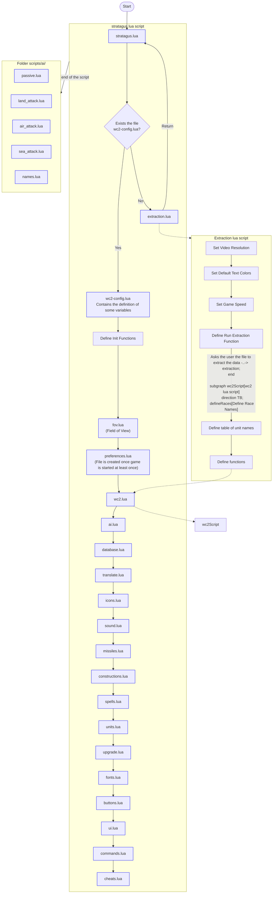

# Flowchart

In the following flowchart it is indicated the order of the script that are loaded when the game is started.

```mermaid
flowchart TB;
Start([Start]) --> stratagus[stratagus.lua];

subgraph stratagusScript["stratagus lua script"]
  stratagus:::luascript --> cond1{"Exists the file\nwc2-config.lua?"} -- No --> extraction[extraction.lua]:::luascript -- Return --> stratagus;
  cond1 -- Yes --> wc2config["wc2-config.lua\nContains the definition of some variables"]:::luascript;
  wc2config --> initFunc[Define Init Functions]; 
  initFunc --> fov["fov.lua\n(Field of View)"]:::luascript;
  fov --> preferences["preferences.lua\n(File is created once game is started at least once)"]:::luascript;
  preferences --> wc2[wc2.lua]:::luascript;
  wc2 --> ai[ai.lua]:::luascript;
  ai --> database[database.lua]:::luascript;
  database --> translate[translate.lua]:::luascript;
  translate --> icons[icons.lua]:::luascript;
  icons --> sound[sound.lua]:::luascript;
  sound --> missiles[missiles.lua]:::luascript;
  missiles --> constructions[constructions.lua]:::luascript;
  constructions --> spells[spells.lua]:::luascript;
  spells --> units[units.lua]:::luascript;
  units --> upgrade[upgrade.lua]:::luascript;
  upgrade --> fonts[fonts.lua]:::luascript;
  fonts --> buttons[buttons.lua]:::luascript;
  buttons --> ui[ui.lua]:::luascript;
  ui --> commands[commands.lua]:::luascript;
  commands --> cheats[cheats.lua]:::luascript;
end

extraction -.-> extractionScript
wc2 -.-> wc2Script

subgraph extractionScript[Extraction lua script]
  direction LR;
  extSetVideoResolution[Set Video Resolution] --> extSetDefaultTextColors[Set Default Text Colors];
  extSetDefaultTextColors --> extSetGameSpeed[Set Game Speed];
  extSetGameSpeed --> runExtraction[Define Run Extraction Function];
  runExtraction -- Asks the user the file to extract the data -..-> extraction;
end

subgraph wc2Script[wc2 lua script]
  direction TB;
  defineRaces[Define Race Names] --> defineTableUnits[Define table of unit names];
  defineTableUnits --> defineWC2Functions["Define functions"];
  defineWC2Functions -.-> wc2;
end

subgraph FolderAI["Folder scripts/ai/"]
  passive.lua:::luascript
  land_attack.lua:::luascript
  air_attack.lua:::luascript
  sea_attack.lua:::luascript
  names.lua:::luascript
end

stratagusScript -- Load at the end of the script --> FolderAI;

click stratagus "https://github.com/Wargus/wargus/blob/master/scripts/stratagus.lua"
click extraction "https://github.com/Wargus/wargus/blob/master/scripts/extract.lua"
click fov "https://github.com/Wargus/wargus/blob/master/scripts/fov.lua"
click wc2 "https://github.com/Wargus/wargus/blob/master/scripts/wc2.lua"
click ai "https://github.com/Wargus/wargus/blob/master/scripts/ai.lua"
click database "https://github.com/Wargus/wargus/blob/master/scripts/database.lua"
click icons "https://github.com/Wargus/wargus/blob/master/scripts/icons.lua"
click sound "https://github.com/Wargus/wargus/blob/master/scripts/sound.lua"
click missiles "https://github.com/Wargus/wargus/blob/master/scripts/missiles.lua"
click constructions "https://github.com/Wargus/wargus/blob/master/scripts/constructions.lua"
click spells "https://github.com/Wargus/wargus/blob/master/scripts/spells.lua"
click units "https://github.com/Wargus/wargus/blob/master/scripts/units.lua"
click upgrade "https://github.com/Wargus/wargus/blob/master/scripts/upgrade.lua"
click fonts "https://github.com/Wargus/wargus/blob/master/scripts/fonts.lua"
click buttons "https://github.com/Wargus/wargus/blob/master/scripts/buttons.lua"
click ui "https://github.com/Wargus/wargus/blob/master/scripts/ui.lua"
click commands "https://github.com/Wargus/wargus/blob/master/scripts/commands.lua"
click cheats "https://github.com/Wargus/wargus/blob/master/scripts/cheats.lua"

classDef luascript stroke:#00f
```
